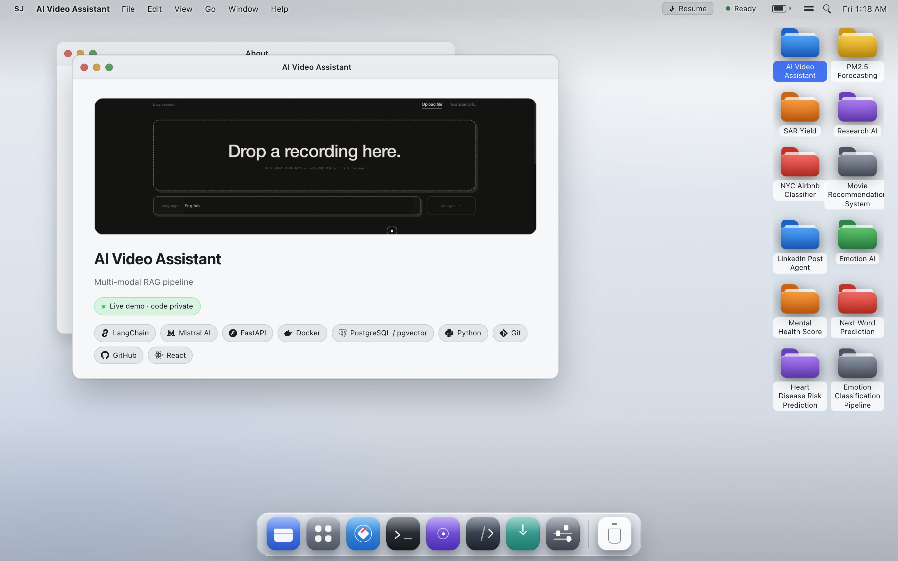
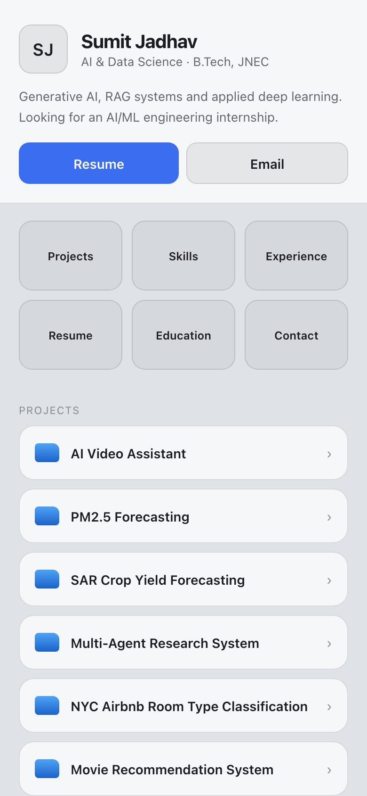

<h1 align="center">SumitOS</h1>

<p align="center">
  A portfolio that boots. Windows, a dock, Launchpad, Spotlight, Spaces and a Shell —
  with a real CMS behind it, so the content changes without a deploy.
</p>

<p align="center">
  <a href="https://github.com/sumitjadhav1703/MacOS-Portfolio/actions/workflows/ci.yml"></a>
  <a href="https://github.com/sumitjadhav1703/MacOS-Portfolio/actions/workflows/security.yml"></a>
  <a href="https://mac-os-portfolio-self-nine.vercel.app"></a>
  <a href="LICENSE"></a>
</p>

<p align="center">
  <a href="https://mac-os-portfolio-self-nine.vercel.app">
    
  </a>
</p>

<p align="center"><b><a href="https://mac-os-portfolio-self-nine.vercel.app">Open the live desktop →</a></b></p>

## What this is

Sumit Jadhav's portfolio, built as a desktop operating system rather than a page you scroll.
Every project is a folder on the desk, a Launchpad tile, a Spotlight hit, a window, and a
`/projects/<slug>` route with its own preview card — all derived from one record.

The site is Next.js on Vercel. Everything that can write — the content API, the admin CMS, the
file uploads, the assistant — lives on a Cloudflare Worker on its own origin. The public site
holds no credential and cannot write anything.

## Quick start

```bash
npm ci
npm run dev        # http://localhost:3000
```

That is the whole setup. **No database, no API keys, no Cloudflare account.** `src/data/` is
compiled in as the fallback, so a fresh clone boots the full desktop with real content.

Needs **Node 24** (there is an `.nvmrc`), and `uv` only if you are working on `ai/`.

## What it looks like

| Desktop — 1440×900 | Phone — 390×844 |
|---|---|
|  |  |

Below 768px the window manager is replaced outright by a stacked shell — not a squeezed desktop.

## Highlights

- **A real window manager.** Drag, resize from eight handles, snap to halves, minimise to the
  dock, zoom, Mission Control, and four Spaces. Geometry persists in `localStorage`.
- **Launchpad, Spotlight (⌘K) and a Shell** that all read the same content, so a project added in
  the CMS is searchable and openable a minute later without a rebuild.
- **Ask Sumit** — a second Worker, written in Python, that answers questions about the portfolio
  grounded in the published bundle. It holds an `AI` binding and no database, so unpublished
  content is not withheld by a rule someone has to remember: it is never in the process.
- **A CMS at `/admin`** with drafts, publish, duplicate, reorder, uploads and optimistic
  concurrency — served by the Worker, on the Worker's origin, behind one session check.
- **Preview cards per project**, rendered with `next/og`.
- **Derived icons.** One resolver reads a technology from a free-text tag and a platform from a
  URL's host, so changing a link in the CMS changes its mark.

## Keyboard

⌘K search · F4 Launchpad · ? shortcuts · ⌘↑ or F3 Mission Control · ⌃← / ⌃→ Spaces ·
⌃⌘← / ⌃⌘→ tile left/right · ⌘⇧F Projects · ⌘W close · ⌘M minimise · ⌘, System · Esc dismiss.
Right-click the desk, a folder, a dock icon or a title bar for its menu.

## Architecture

```
recruiter -> mac-os-portfolio-self-nine.vercel.app     Vercel, static, no login anywhere
                 |  GET /api/content                   anonymous, cached at the edge
                 v
owner     -> sumitos-api.<account>.workers.dev/admin
                 |                                     password + HttpOnly session cookie
             Worker --+-- D1                           content, sessions
                      +-- R2                           resume, covers, certificate files
                      +-- sumitos-ai                   the assistant, no route of its own
```

The admin UI is served by the Worker, same origin as the admin API, so the session cookie is
`HttpOnly; Secure; SameSite=Strict` and is never a third-party cookie. The public site only ever
makes anonymous cross-origin `GET`s; the API rejects every other method outright.

## Testing

```bash
npm run ci          # lint, tests, types, secret scan, migration check, build, bundle size
npm run ai:test     # pytest over ai/ — pure Python, no runtime needed
npm run e2e         # the desktop and the mobile shell, in Chromium
npm run e2e:admin   # the CMS, against a real Worker with a real local D1
```

`npm run ci` is the same command GitHub Actions runs, so a green terminal and a green workflow
mean the same thing. It ends with the build, which is where the app's own types are checked.

`npm run e2e:admin` builds the admin SPA, migrates a throwaway local database, generates a
password for that run alone and starts `wrangler dev --local`. No credential is stored anywhere,
and `--local` is the only mode used — there is no path from a test to the production database.

Some things are still only checkable in a browser. [AGENTS.md](AGENTS.md) lists them, and
[docs/release-checklist.md](docs/release-checklist.md) asks for them before a release.

## Continuous integration

| Workflow | Runs on | Does |
|---|---|---|
| `ci.yml` | pull request, push to `master` | the gate, the Python suite, both browser suites, migrations |
| `security.yml` | pull request, push, weekly | CodeQL over the code, the assistant and the workflows |
| `dependency-review.yml` | pull request | blocks a new high or critical advisory |
| `release.yml` | tag `v*` | runs the gate, drafts a release |

Nothing deploys from CI. `wrangler deploy` stays a deliberate human action, which is what keeps
every Cloudflare credential out of this repository. Branch protection is configured in GitHub
rather than in these files — see [docs/github-settings.md](docs/github-settings.md).

---

<details>
<summary><b>Repository layout</b></summary>

```
app/
  layout.tsx                 document, site metadata
  page.tsx                   the desktop
  opengraph-image.tsx        1200×630 site card
  projects/[slug]/
    page.tsx                 generateStaticParams + generateMetadata, opens that project
    opengraph-image.tsx      1200×630 card for the project, via next/og ImageResponse
src/
  data/                      projects, profile links, section copy, Shell/AI text
  og/card.tsx                the card both images render
  site-url.ts                the public origin, resolved once
  os/
    store.tsx                windows, Spaces, preferences (useReducer + context)
    shell/                   menu bar, dock, Launchpad, context menus, wallpaper,
                             Notification Center, Control Center, toasts, boot
    wm/                      window chrome, drag, resize, snapping, Mission Control
    apps/                    About, Finder, Safari, Shell, Ask Sumit, Code, System,
                             Resume, Contact, and one window per project
    search/                  Spotlight (⌘K) and the shortcut sheet (?)
    mobile/                  the stacked layout used below 768px
  styles/os.css              chrome stylesheet, lifted from the original design
worker/                      the Cloudflare Worker: public read API + admin API + admin UI
  index.ts                   router
  content.ts                 D1 rows -> the content bundle, and its edge cache
  auth.ts admin.ts files.ts  sessions, CRUD, R2 uploads
  tables.ts                  one spec per content type; the CRUD handler is generic
  admin-ui/                  the admin SPA (Vite + React), built into worker/assets
ai/                          Ask Sumit: a Python Worker with an AI binding and no database
migrations/                  versioned D1 migrations; 0002 is generated from src/data
scripts/                     generators, checks, the secret scan, the smoke test
legacy/                      the original single-file build, kept for reference
```

</details>

<details>
<summary><b>Adding a project</b></summary>

Through the admin, at `/admin` on the Worker: **Projects -> Add project**, then Publish. The
desktop folder, Finder entry, Launchpad tile, window, Spotlight hit, Shell alias,
`/projects/<slug>` route and preview image all follow from the one record.

`src/data/projects.ts` is the seed and the offline fallback rather than the live source. Editing
it changes what a fresh database is seeded with, and what the site shows if the API is
unreachable; it does not change published content.

Content changes need no release, no tag and no deploy. Code changes do — see
[docs/release-process.md](docs/release-process.md).

</details>

<details>
<summary><b>The API</b></summary>

Public, read-only, `GET` only. Each is a slice of one cached bundle, so extra endpoints cost no
extra database reads:

```
/api/content   /api/projects   /api/projects/:slug   /api/certificates   /api/experience
/api/education /api/skills     /api/social-links     /api/site           /api/os
/api/resume    /files/:key
```

`POST /api/ask` is the one exception to the read-only rule, and it writes nothing.

Admin, all behind the session check, all on the Worker's own origin:

```
POST   /admin/api/login  logout            GET /admin/api/me  stats
GET|POST      /admin/api/:type             PATCH|DELETE /admin/api/:type/:id
PUT           /admin/api/site  /admin/api/os
POST          /admin/api/reorder/:type
GET|POST      /admin/api/files             DELETE /admin/api/files/:key
```

</details>

<details>
<summary><b>Environment and local development</b></summary>

Three names in total. Only the last is a secret, and it is never in a file that is committed.

| Name | Where | What it is |
|---|---|---|
| `NEXT_PUBLIC_API_URL` | Vercel | The Worker's origin. **Unset** and the site serves `src/data/` — which is why it builds and runs with no database at all |
| `SITE_ORIGIN` | `wrangler.jsonc`, plain var | The public origin. Used for CORS and to resolve the packaged resume URL |
| `ADMIN_PASSWORD_HASH` | `wrangler secret put` | The one real secret. `pbkdf2$<iterations>$<salt>$<hash>`, from `node scripts/hash-password.mjs` |

Locally the last two live in `.dev.vars`, which is gitignored and must stay that way. Quote the
hash with **single** quotes — the file is parsed as dotenv and the hash is full of `$`.

```bash
npm run worker:migrate:local                # local D1, never the production database
npm run worker:dev                          # http://localhost:8787, /admin included
NEXT_PUBLIC_API_URL=http://127.0.0.1:8787 npm run dev
```

`SITE_ORIGIN` is the CORS allowlist, so without it in `.dev.vars` the local Worker refuses the
local site and the desktop quietly serves its bundled content instead of saying so.

</details>

<details>
<summary><b>Deploying, and rolling back</b></summary>

[**docs/deployment.md**](docs/deployment.md) is the full runbook — every step with what it does,
why it exists, where to run it, what to expect and what to do when it fails. The short version,
in the order that works:

```bash
# 1. Enable R2 in the Cloudflare dashboard. Nothing on the command line can do it.
# 2. Import the repo on Vercel with NEXT_PUBLIC_API_URL unset. The site ships its bundled
#    content, and the URL it hands back is the SITE_ORIGIN below.

npx wrangler d1 create sumitos               # put the printed id in wrangler.jsonc
npx wrangler r2 bucket create sumitos-assets
# Set vars.SITE_ORIGIN to the origin Vercel assigned. `npm run worker:deploy` checks both first.

npm run worker:migrate                       # applies the migrations to the remote database
npm run ai:deploy                            # sumitos-ai first: sumitos-api binds to it
npm run worker:deploy                        # builds the admin UI, deploys the Worker

node scripts/hash-password.mjs               # prints the hash; the password is never stored
npx wrangler secret put ADMIN_PASSWORD_HASH  # paste it
```

Then set `NEXT_PUBLIC_API_URL` on Vercel to the Worker's URL and redeploy the site.

```bash
npx wrangler deployments list
npx wrangler rollback [deployment-id]
```

Worker deployments are versioned, so a bad deploy is one command back. Database changes are not —
D1 has no rollback, and a bad migration is corrected by the next numbered one, never by editing
the applied one.

</details>

<details>
<summary><b>What it costs</b></summary>

Everything sits inside the Cloudflare free tier with a wide margin: Workers 100k requests/day,
D1 5M rows read and 100k written per day with 5 GB storage, R2 10 GB-month with free egress. The
whole public API is one cached bundle refreshed at most once a minute per location, and R2
objects are immutable so they are cached indefinitely. Vercel's Hobby plan covers the site.

</details>

---

## Security

Please report a vulnerability privately, through
[a security advisory](https://github.com/sumitjadhav1703/MacOS-Portfolio/security/advisories/new)
rather than as a public issue. [SECURITY.md](SECURITY.md) has the details, and explains how the
security model actually works — which makes for better reports.

## Licence

[MIT](LICENSE), for the code.

The content is not covered by it: the resume, the biography, the project write-ups and the
photographs are Sumit Jadhav's. Take the desktop, the window manager and the CMS and do what you
like with them — please do not publish them as your own portfolio with the name changed.
